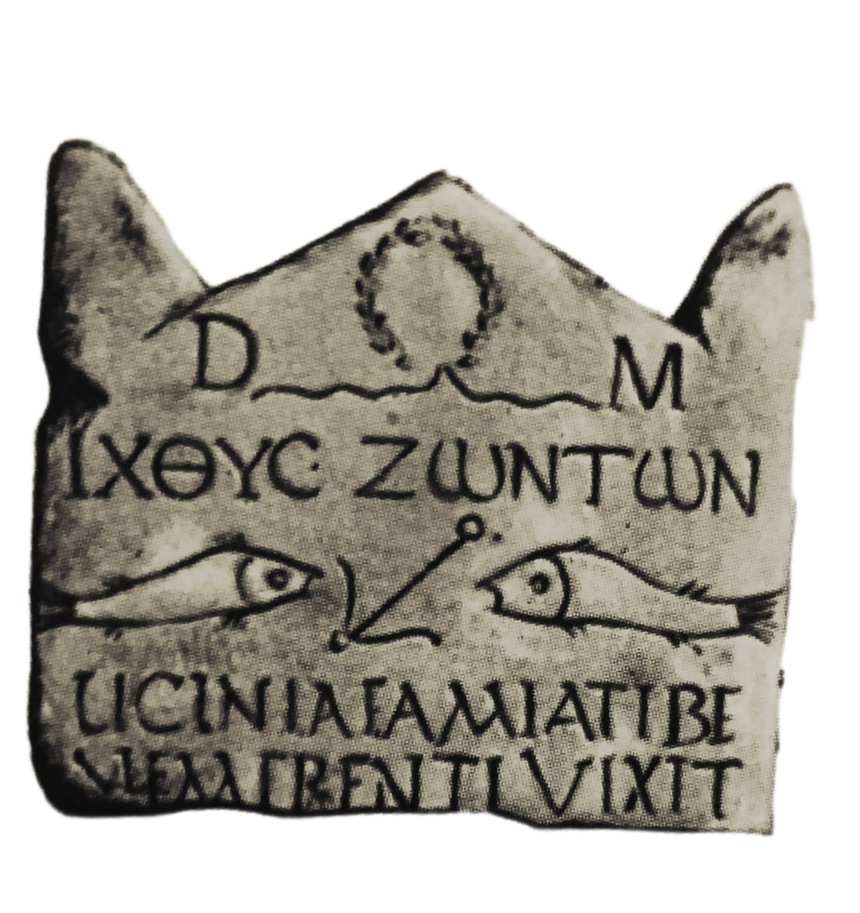

# Hello there! 

## My name is Miguel Ferreira and I'm a **web/desktop developer** and **data scientist**.

<i>Caspar David Friedrich</i>

I have familiarity with most of **Python technologies** of **machine learning and data science** but my most important tool is my capability to link different fields of knowledge in a engaging algorithm. My interests include:

- 📊 Machine learning, IA and its implications 📉
- ➗ Mathematics for machine learning and data science
- 📚 Philosophy, history and why world is what it is 📖
- 🏊‍ Swimming, chess (not specifically well played)
- 🌎 Nature and how it defines us at all ☀️🌊

>*“People worry that computers will get too smart and take over the world, but the real problem is that they're too stupid and they've already taken over the world.”*
>>
<b>Pedro Domingos</b> (creator of Markov Logic Network)

  
<b>What do I do?</b>

     

**Everything involving machine learning, IA, data science and each pipeline step since the data obtention to hosting is of my interest**.
  
  - **CRISP-DM Methodology** :bar_chart:
  - **Data cleaning** :clipboard:
  - **EDA and data insights** :chart_with_upwards_trend:
  - **Model creation** :game_die:
  - **Model performance analysis** :space_invader:
  - **Hosting** :beers:
  
    

  
 

  

  
<b>:wave:About me</b>

   
  
- **Nature affects me** 🌳🌋.
  
  

<i>Pic I took. Going home at dusk.</i>

  
I love **nature**. That's why I chose _The wanderer above the sea of fog_ to open my overview 🎨. It's the epitome of the romantically nature affected man. With romantic I mean not traditionally romantic, like Titanic or Romeo and Juliet, but romantic by thinking over our place in world.
  
  

<i>From the building I work in 🌞</i>

  
- **Machine learning beyond it's definition** :exclamation::exclamation::boom:.
  
  

<i>LSTM Neural Network with ReLU activation function for image recognition</i>

  
I really think deeply not only over the problems machine learning can solve for humanity and how it will change work. But I think too about philosophical implications 🤔. What their learning process can teach us about ours? What should we to do to improve their capacity of understanding the world? What lesson should a IA singularity take?

  

<i>Neuron made by God ☝️</i>

 
  
  

<i>Artificial neuron</i>

  
  

<i>ReLU activation neurons nodes. As you can see, it's a sequence of linear function sums. The L in ReLU goes for linear.</i>

  
        
- **Philosophy and religion** 🙏✝️⛪
  
  

<i>Gigachad</i>

  
The guy in photo is ***Mircea Eliade***, the greatest mithologist and comparative religion researcher of sec. XX. His invetigations regarded of why do we think, act and behave like we do. Why do we constitute culture, sing 🎵, paint 🖌️ or dance 💃? You may not understand why this has anything to do with programming but we haven't never in history been so distant from the things that turns us humans, **for the codes we're programming are now programming us**.  
  
That's why I really love studying religion, culture and history. It turns me even into a better programmer. For I'm worried what we could reach with our progress and what may we lose. 

  

<i>Christian tablet from pre-Nicene period ✝️.</i>

 

  

  
<b>:feelsgood:Contact me</b>

   
  
  - 
  - 
  - 
  - 

You may also be interested in my [weblog](paraisoreavido.github.io).
  

